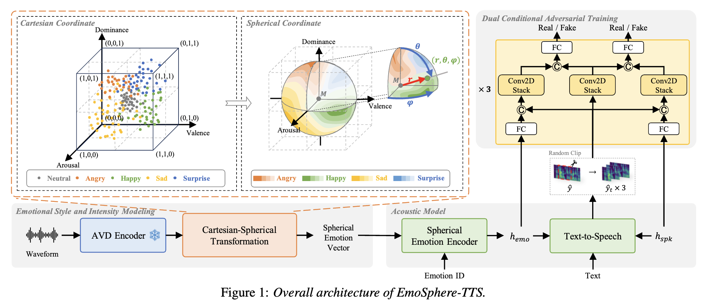

# Emotional-FastSpeech2 - PyTorch Implementation

<p align="center">
    
</p>


## ✨ EmoSphere-TTS: Controllable Emotional TTS using Spherical Emotion Vector

implementations of the basic paradigm intorduced by [EmoSphere-TTS: Emotional Style and Intensity Modeling via Spherical
Emotion Vector for Controllable Emotional Text-to-Speech](https://github.com/Choddeok/EmoSphere-TTS). [paper](https://arxiv.org/pdf/2406.07803)

<p align="center">
    
</p>


This project implements a controllable emotional text-to-speech (TTS) system, based on EmoSphere-TTS. Unlike conventional methods that rely on discrete emotion labels or reference audio, this approach models emotional style and intensity using a spherical emotion vector derived from arousal, valence, and dominance (AVD) dimensions.

AVD pseudo-labels are extracted automatically via a pre-trained SER model, then transformed from Cartesian to spherical coordinates. In this space:
 -	Emotion style is determined by angular direction (θ, φ)
 -	Emotion intensity is represented by radial distance (r) from the neutral center

The spherical emotion vector is encoded and conditioned into a FastSpeech2-based TTS model. Emotion and speaker embeddings are fused to generate expressive and high-quality speech. To further enhance realism and emotional fidelity, a dual conditional adversarial discriminator is employed, conditioned on both speaker and emotion representations.

We recommend reading the original paper and referring to FastSpeech2 for baseline details.

✅ Key Highlights:
- Spherical emotion vector allows fine-grained, interpretable control over emotional speech synthesis.
- Emotion style and intensity are independently manipulable during inference.
- Outperforms previous approaches in both audio quality and emotional expressiveness.
- No human annotations required — emotion pseudo-labels are automatically derived.

📌 Architecture components:
- AVD Encoder using wav2vec 2.0
- Cartesian-to-Spherical Transformation for emotion modeling
- Spherical Emotion Encoder to condition emotion vectors
- FastSpeech2 with emotion and speaker conditioning

#### TODO
- Dual Conditional Adversarial Discriminator


## Dependencies

Please install the python dependencies given in `requirements.txt`.

```bash
# train.py, synthesize.py
pip3 install -r requirements.txt

# polar_coordinate.py
pip install -r requirements_polar.txt
```

## Preprocess

IMECAP

### Train MFA from scratch

To train MFA, grapheme-phoneme dictionary that covers all the words in the dataset is required. Following command will generate such dictionary in lexicon/.
```bash
python3 prepare_data.py --extract_lexicon -p config/{dataset}/preprocess.yaml
```

After that, train MFA

```bash
mfa train  ./raw_data/{dataset}/sessions lexicon/iemocap-lexicon.txt montreal-forced-aligner/iemocap-aligner/acoustic_model.zip --output_directory preprocessed_data/{dataset}/TextGrid -j 8 --clean --include_speaker_directory

```

Finally, run the preprocessing script. It will extract and save duration, energy, mel-spectrogram, and pitch in preprocessed_data/{dataset}/ from each audio.

```bash
python3 preprocess.py config/{dataset}/preprocess.yaml
```


## Training

```bash
python3 train.py -p config/ESD/preprocess.yaml -m config/ESD/model.yaml -t config/ESD/train.yaml
```

## Inference

```bash
python3 synthesize.py --text "YOUR_DESIRED_TEXT" --speaker_id SPEAKER_ID --emotion_id EMOTION_ID --arousal AROUSAL --valence VALENCE --restore_step STEP --mode single -p config/ESD/preprocess.yaml -m config/ESD/model.yaml -t config/ESD/train.yaml
```


Batch inference is also supported, try

```bash
# Single
python3 synthesize.py --use_sphere --text "I'm a boy" --speaker_id 0011 --emotion_id 'Sad' \
 --arousal 'mid' --valence "neutral" --restore_step 900000 --mode single \
 -p config/ESD/preprocess.yaml -m config/ESD/model.yaml -t config/ESD/train_sphere.yaml 

# Batch
 python3 synthesize.py --source preprocessed_data/ESD/val_surprise.txt --restore_step 900000 --mode batch \
  -p config/ESD/preprocess.yaml -m config/ESD/model.yaml -t config/ESD/train_sphere.yaml \
  --use_sphere --emo_style V --emo_intensity 0.9
```

## TensorBoard

Use

```bash
tensorboard --logdir output/log
```

## Citation

If you would like to use or refer to this implementation, please cite the repo.

```bash
@misc{jo2025fastspeech2_plus,
  author = {Jo},
  title = {FastSpeech2-Plus},
  year = {2025},
  publisher = {GitHub},
  journal = {GitHub repository},
  howpublished = {\url{https://github.com/nebulajo/FastSpeech2-Plus}}
}
```

## References
- [keonlee9420's Expressive-FastSpeech2](https://github.com/keonlee9420/Expressive-FastSpeech2/)
- [Choddeok's EmoSphere-TTS](https://github.com/Choddeok/EmoSphere-TTS)
- [ming024's FastSpeech2](https://github.com/ming024/FastSpeech2)