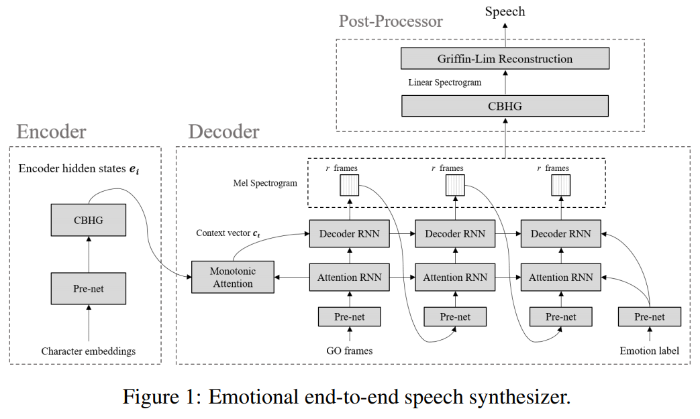

# Emotional-FastSpeech2 - PyTorch Implementation

<p align="center">
    
</p>


1. `Emotional TTS`: Following branches contain implementations of the basic paradigm intorduced by [Emotional End-to-End Neural Speech synthesizer](https://arxiv.org/pdf/1711.05447.pdf).

<p align="center">
    
</p>

2. `Emosphere TTS`: Following branches contain implementations of the basic paradigm intorduced by [EmoSphere-TTS: Emotional Style and Intensity Modeling via Spherical
Emotion Vector for Controllable Emotional Text-to-Speech](https://github.com/Choddeok/EmoSphere-TTS). [paper](https://arxiv.org/pdf/2406.07803).

<p align="center">
    
</p>


## Dependencies

Please install the python dependencies given in `requirements.txt`.

```bash
# train.py, synthesize.py
pip3 install -r requirements.txt

# polar_coordinate.py
pip install -r requirements_polar.txt
```

## Preprocess

IMECAP

### Preprocessing
Run prepare_align() to generate .lab and .wav files in ~/raw_data/LJSpeech/LJSpeech/.

<details>
<summary>preprocessing detail</summary>
<div markdown="1">

- Reads LJ001-0001.wav and metadata.csv for preprocessing.

- Generates normalized .wav files:
- 16-bit audio range: −32,768 ~ +32,767 (2^16 = 65,536 levels)

```python
wav, _ = librosa.load(wav_path, sampling_rate)
wav = wav / max(abs(wav)) * max_wav_value  # 16-bit: use 32768.0
wavfile.write(os.path.join(out_dir, speaker, f"{base_name}.wav"),
              sampling_rate, wav.astype(np.int16))
```

- Generates .lab files:
  - Cleans text with from text import _clean_text using ["english_cleaners"]:
    1. Lowercasing
    2. Special character handling (e.g., 123 → "one hundred twenty three", remove/convert symbols, expand abbreviations)
    3. Trim extra spaces
    4. Normalize pronunciation symbols

```python
text = _clean_text(text, cleaners)
with open(os.path.join(out_dir, speaker, f"{base_name}.lab"), "w") as f:
    f.write(text)
```
</div>
</details>


```bash
python3 prepare_align.py config/{dataset}/preprocess.yaml
```

### Train MFA from scratch

To train MFA, grapheme-phoneme dictionary that covers all the words in the dataset is required. Following command will generate such dictionary in lexicon/. (using g2p package)


```bash
python3 prepare_data.py --extract_lexicon -p config/{dataset}/preprocess.yaml
```
**Note:** Leave blank if the page contains no content.

After that, train MFA

```bash
mfa train  ./raw_data/{dataset}/sessions lexicon/iemocap-lexicon.txt montreal-forced-aligner/iemocap-aligner/acoustic_model.zip --output_directory preprocessed_data/{dataset}/TextGrid -j 8 --clean --include_speaker_directory

```

Finally, run the preprocessing script. It will extract and save duration, energy, mel-spectrogram, and pitch in preprocessed_data/{dataset}/ from each audio.

```bash
python3 preprocess.py config/{dataset}/preprocess.yaml
```


## Training

```bash
python3 train.py -p config/{dataset}/preprocess.yaml -m config/{dataset}/model.yaml -t config/{dataset}/train.yaml
```

## Inference

```bash
python3 synthesize.py --text "YOUR_DESIRED_TEXT" --speaker_id SPEAKER_ID --emotion_id EMOTION_ID --arousal AROUSAL --valence VALENCE --restore_step STEP --mode single -p config/{dataset}/preprocess.yaml -m config/{dataset}/model.yaml -t config/{dataset}/train.yaml
```


Batch inference is also supported, try

```bash
# Single
python3 synthesize.py --use_sphere --text "I'm a boy" --speaker_id 0011 --emotion_id 'Sad' \
 --arousal 'mid' --valence "neutral" --restore_step 900000 --mode single \
 -p config/{dataset}/preprocess.yaml -m config/{dataset}/model.yaml -t config/{dataset}/train_sphere.yaml 

# Batch
 python3 synthesize.py --source preprocessed_data/{dataset}/val_surprise.txt --restore_step 900000 --mode batch \
  -p config/{dataset}/preprocess.yaml -m config/{dataset}/model.yaml -t config/{dataset}/train_sphere.yaml \
  --use_sphere --emo_style V --emo_intensity 0.9
```

## TensorBoard

Use

```bash
tensorboard --logdir output/log
```

## Citation

If you would like to use or refer to this implementation, please cite the repo.

```bash
@misc{jo2025fastspeech2_plus,
  author = {Jo},
  title = {FastSpeech2-Plus},
  year = {2025},
  publisher = {GitHub},
  journal = {GitHub repository},
  howpublished = {\url{https://github.com/nebulajo/FastSpeech2-Plus}}
}
```

## References
- [keonlee9420's Expressive-FastSpeech2](https://github.com/keonlee9420/Expressive-FastSpeech2/)
- [Choddeok's EmoSphere-TTS](https://github.com/Choddeok/EmoSphere-TTS)
- [ming024's FastSpeech2](https://github.com/ming024/FastSpeech2)